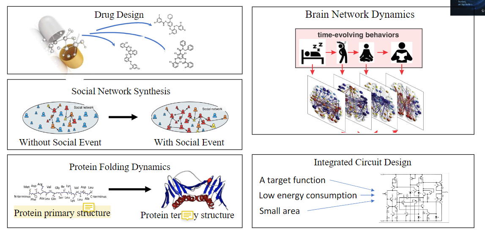
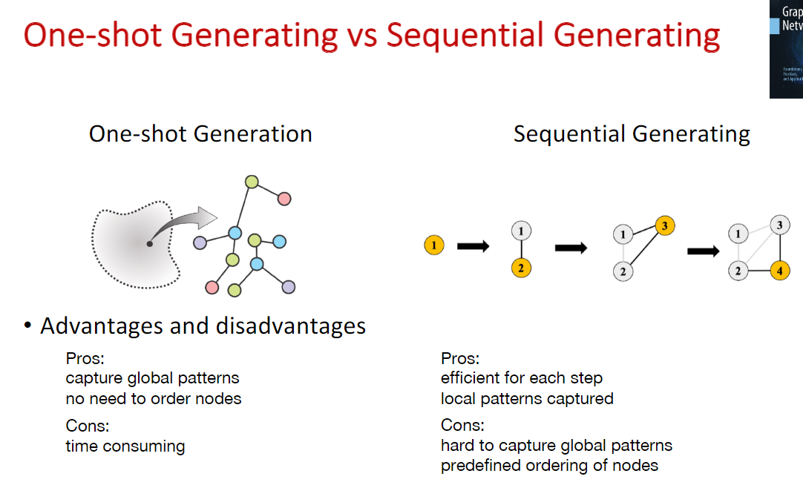
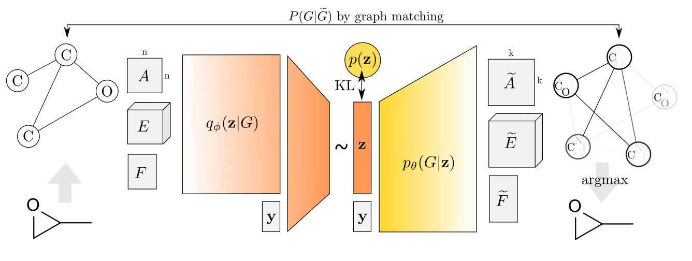
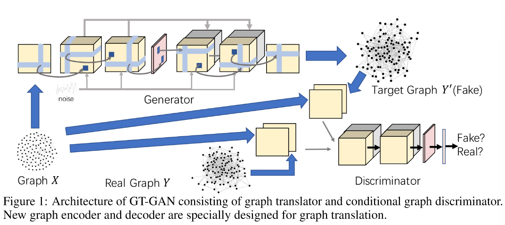
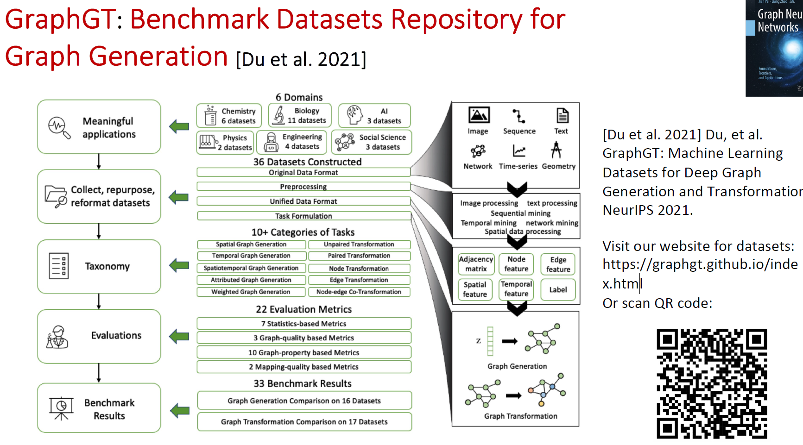
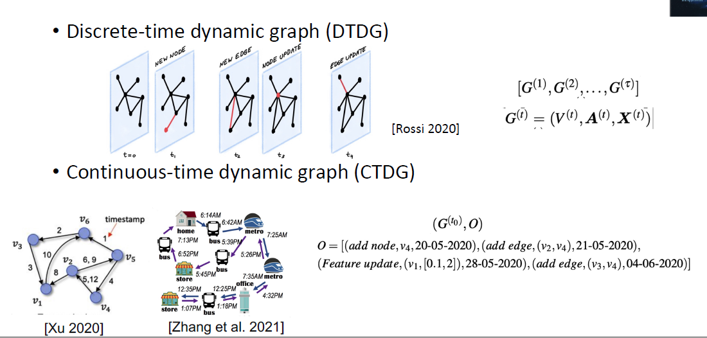
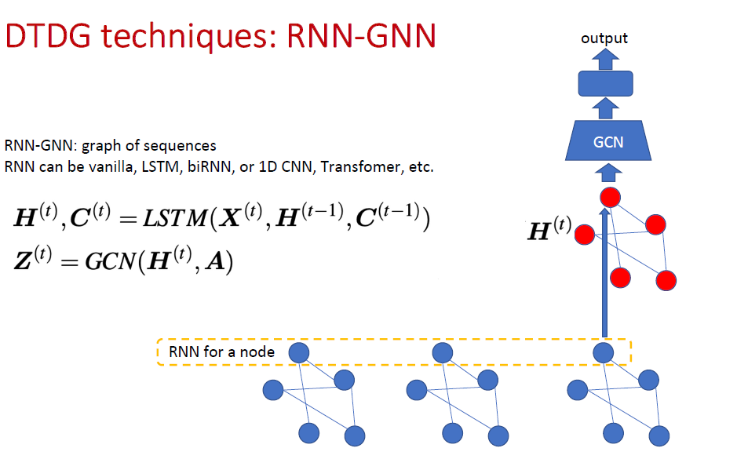
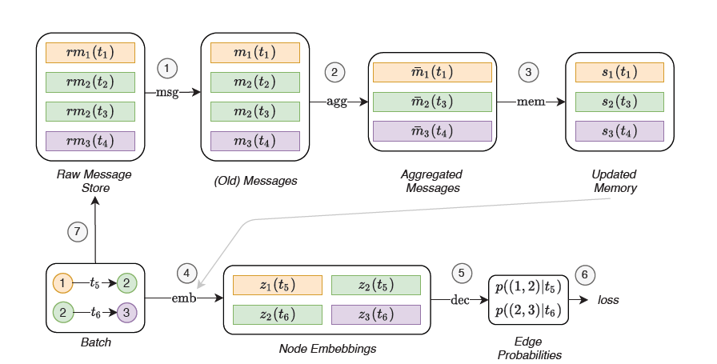
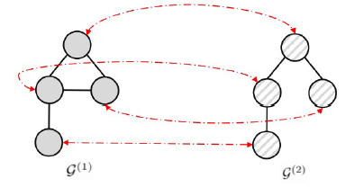
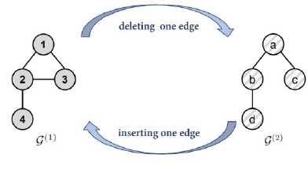

# Graph Neural Networks: Foundations, Frontiers, Applications

[TOC]

## Graph Generation & Transformation

### Graph Generation Application

Two main methods: 

* One-shot generation
* Sequential generation

#### GraphVAE(One-shot generation)

* Encoder: GNN graph to vector 

* Decoder(generator): MLP vector to A E F (graph)

### Graph Translation

#### GT-GAN

GT-GANs learn a conditional generative model, which is a graph translator that is conditioned on input graph and generate the associated target graph.

Aim at translating a graph with one modality to a new one with other modality using deep neural networks architecture. Eg: Examples include generating the traffic jam situation given a road network without traffic jam.

* Graph translator
  * Encoder + decoder 
* Conditional graph discriminator

### Benchmark dataset

#### GraphGT

### Future Opportunities

* Scalability.
* Validity constraint
* Interpretability and Controllability.

## Dynamic Graph

### Two dynamic graph types (diff?)

Operations of graph dynamics:
- Node addition/deletion
- Feature update
- edge addition/deletion
- edge weight updates

### Task types

-  Dynamic Node classification/regression
-  Dynamic graph classification
-  Dynamic link prediction
-  Time prediction

### RNN-GNN(TGN)

TGN network arch

#### Future directions

-  Node addition and removal are still challenges.
-  Inverse problem of graph dynamics
-  Spatiotemporal

## Graph Matching

### Graph Matching Application

* Graph similar searching in graph based database
* 3D Action Recognition
* Unknown malware(恶意代码) detection 

### Problem Formulation

There are two kinds of graph matching formulation

#### Node Correspondence

Find a node-to-node correspondence matrix between two graphs.

* NP-hard
* Computationally expensive and Poor scalability

#### Similarity Learning

Produce a similarity score between two graphs

* NP-hard
* GNN-based methods demonstrating superiority over traditional methods

Input: a pair of graph inputs $(G^1,G^2)$

* $G^1=(V^1,E^1)$ with $(X^1,A^1)$, where $X^1\in R^{N*d},A^1\in R^{N*N}$
* $G^2=(V^2,E^2)$ with $(X^2,A^2)$, where $X^2\in R^{N*d},A^2\in R^{N*N}$

Output

* $Y=\{-1,1\}$: graph-graph classification task
* $Y=[0,1]$: graph-graph regression task

GraphSim: 

* 节点间的顺序是怎么确定的？

* 在得到相似度矩阵后怎么操作？类似于CNN(卷积、池化啥的)
