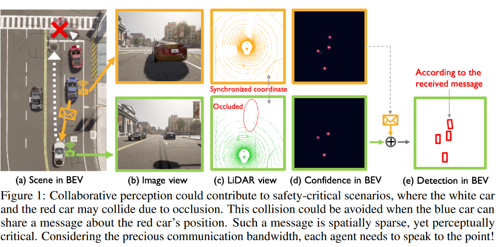
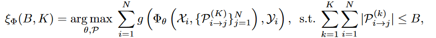
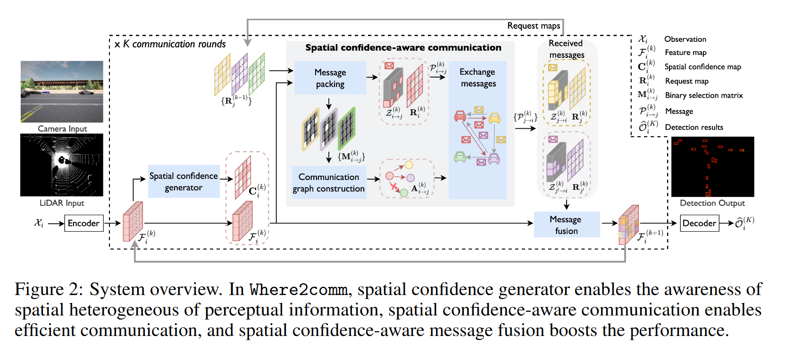
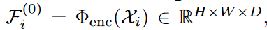
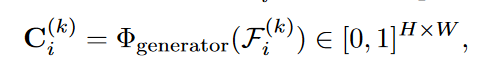
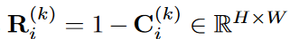
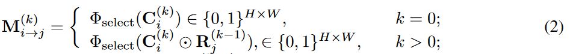
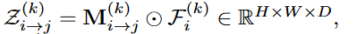
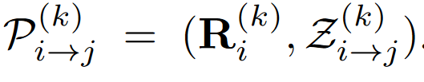
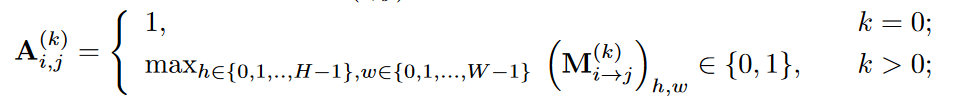

# Where2comm: Communication-Efficient Collaborative Perception via Spatial Confidence Maps

## Intro

Task: Multi-agent collaborative perception

Scenarios: 

* vehicle-to-everything-communication-aided autonomous driving 
* multirobot warehouse automation system
* multi-UAVs (unmanned aerial vehicles) for search and rescue.

Current challenge: how to optimize the trade-off between perception performance and communication bandwidth.

The core idea is to enable a **spatial confidence map** for each agent, where each element reflects the perceptually critical level of a corresponding spatial area

Three key module:

* A spatial confidence generator
  * produce spatial confidence map
* A spatial confidence-aware communication module
  * where and who to communicate
* A spatial confidence-aware message fusion module
  * fuses messages received from other agents

## Formulation

Objective: achieve the maximized perception performance of all agents as a function of the total communication budge $B$ and communication round $K$

* $g$ perception evaluation metric
* $\Phi$ perception network
* $P_{i\rightarrow j}^{(k)}$: the message transmitted from the $i$ th agent to the $j$ th agent at the $k$ th communication round

consider the perception task of 3D object detection and present three contributions: 

* communication more efficient by designing compact messages and sparse communication graphs;
* boost the perception performance by implementing more comprehensive message fusion;
* enable the overall system to adapt to varying communication conditions by dynamically adjusting where and who to communicate.

## Module

Module includes: observation encoder, a spatial confidence generator, the spatial confidence-aware communication module, the spatial confidence-aware message fusion module and a detection decoder

### Observation encoder

$H,W,D$: height, width, channel

### Spatial confidence generator

the area with high perceptually critical level $\Rightarrow$ a high confidence score.

generate map from feature map $F$

### Spatial confidence-aware communication

#### Massage packing

consider two areas

* low confidence score
  * no objects or something missing 
  * indicates there could be missing information at that location.
* high confidence score

Define the request map: 

* $\odot$ element-wise multiple
* why element-wise multiple?
  * R: the lost information in previous round, C: the important area in current round 

Define the selected feature map:

Define the message transmitted from the $i$ th agent to the $j$ th agent at the $k$ th communication round: 

* $R^{(k)}_i$ provides spatial priors to request **complementary information** for the $i$ th agent’s need in the next round; 

* $Z_{i\rightarrow j}^{(k)}$ provides supportive information for the $i$ th agent’s need in the this round. 

#### Communication graph construction

The necessity of communication between the $i$ th and the $j$ th agents:  the overlap between the information that the $i$ th agent has and the information that the $j$ th agent needs.

$A^{(k)}$: the adjacency matrix of communication graph (**if agent $i$ and $j$ communicate**)

### Spatial confidence-aware message fusion